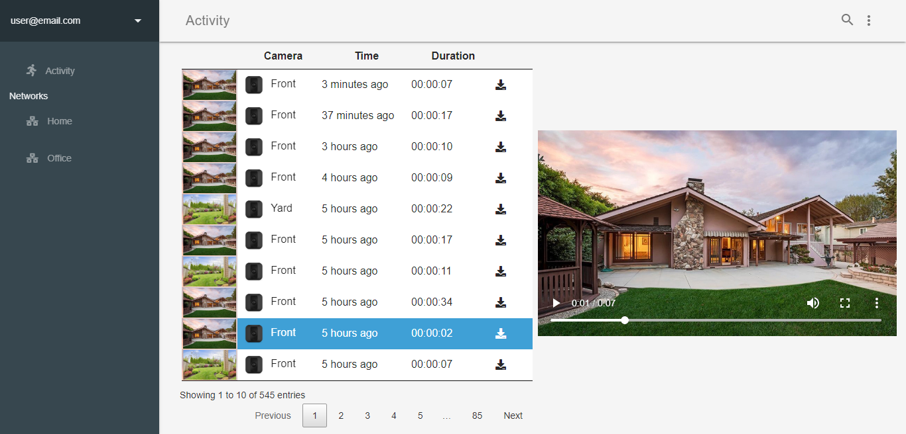

# blink-viewer
Blink Home Security Camera is a great product but currenty lacks of an official web viewer. This project is an attempt to create a web viewer that complements the current Mobile application. In conjuntion with blink-browser project, it works as a Desktop solution for Blink Systems. 

## Example
### Networks
Check current thumbnail, battery status and temperature for all cameras of each network


### Activity
View and download all videos



## Security
This viewer is just a frontend application. This means user credentials are never stored, being directly forwarded to Immedia servers. 
Once login succeeds, server returns a token that will be provided in future REST API calls. 

## Installation Guide
As Immedia server is not being proxied by any other server, trying to run the application in a Chrome browser will incur in CORS problems. 
Using CORS plugin will not solve the problem as some Immedia endpoints do not implement OPTIONS method for some calls. Chrome's preflight request 
will fail for this reason. 

To avoid this problem you can:

* Close all instances of Chrome browser (open taskmanager and kill any resilient Chrome process). Execute 
```
./chrome.exe --user-data-dir=<path to viewer>. 
```
This executable is located at C:\Program Files (x86)\Google\Chrome\Application

* Use Blink browser, another project WIP. This browser is a modified CEF that will automatically add Immedia servers to CORS headers. 
Additionally, this browser provides advanced functionality like automatic videos backup.
